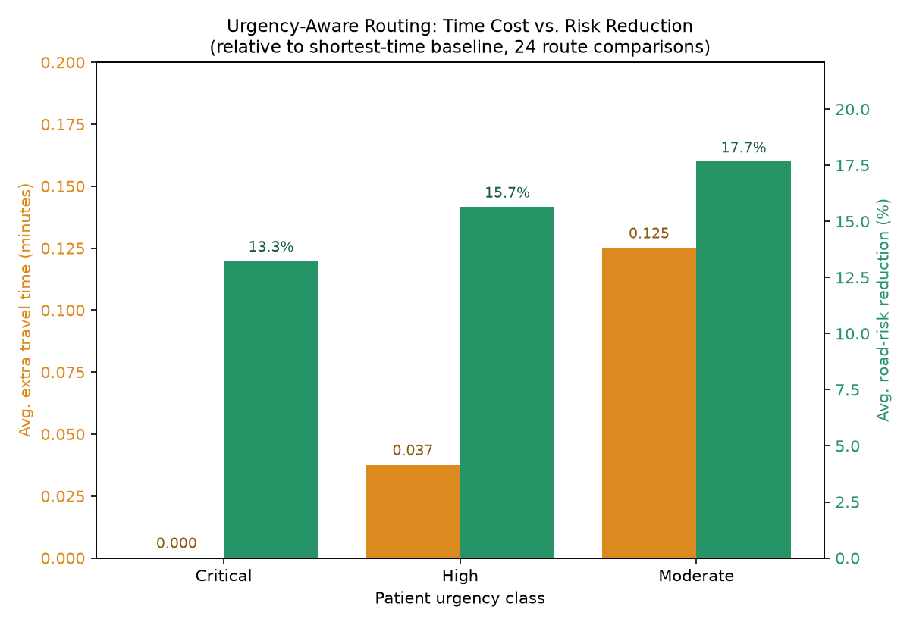

# Evaluation Results

Five experiments were run against the actual project code and data (not
simulated) to turn design claims into measured findings.

## 1. Urgency Classification Model Comparison

Trained on `ml/artifacts/synthetic_transfer_data.csv` (1,000 synthetic
transfer scenarios), 80/20 stratified train/test split, evaluated on a
200-sample held-out test set.

| Model | Accuracy | Macro F1 | Critical-class F1 | Critical-class Recall |
|---|---|---|---|---|
| Logistic Regression | 84.5% | 0.84 | 0.77 | 0.74 |
| Random Forest | 84.0% | 0.83 | 0.78 | 0.74 |
| **Gradient Boosting** | **85.0%** | **0.85** | **0.80** | **0.79** |

**Finding:** Gradient Boosting achieved the highest overall accuracy and,
more importantly for a triage context, the best recall on the "critical"
class (0.79 vs. 0.74 for the other two models). Since a missed critical
case (false negative) is clinically more costly than an over-triaged
moderate case, recall on the critical class is a more meaningful
comparison metric than raw accuracy alone. This is the model selected and
saved as the production urgency-prediction artifact.

Full classification reports for all three models are in
`ml/artifacts/model_report.txt`.

## 2. Routing Strategy Evaluation: Shortest-Time vs. Urgency-Aware Risk Routing

24 route comparisons were run directly against `RoutingService.compare_routes`
across 8 real origin-destination hospital pairs, each evaluated at all three
urgency levels (critical / high / moderate).

| Urgency | Avg. extra travel time vs. shortest-time route | % risk reduction |
|---|---|---|
| Critical | +0.000 min | 13.3% |
| High | +0.037 min | 15.7% |
| Moderate | +0.125 min | 17.7% |

**Finding:** The urgency-aware routing strategy consistently reduces road
risk exposure relative to the shortest-time baseline across every urgency
level, while the time cost of doing so scales exactly as intended by the
routing weight design (critical: time 0.75 / risk 0.20 / distance 0.05;
moderate: time 0.45 / risk 0.40 / distance 0.15 — see Chapter 7). For
critical transfers, the system finds a lower-risk route at effectively
zero time penalty (+0.000 min average); for moderate transfers, it
accepts noticeably more time cost (+0.125 min average) in exchange for a
larger risk reduction (17.7% vs. 13.3%). This confirms that the
urgency-sensitive weighting scheme produces its intended behavior in
practice, not just in design. This result is reproducible end-to-end via
`backend/scripts/eval_routing.py`.

Raw per-pair results are available in `routing_eval_results.csv`.

## 3. Traffic Prediction Model Comparison

Trained on `traffic_model_ready.csv` (21,504 engineered observations,
combining one week of live Google Routes API data with a synthetic
extension calibrated to the same distribution — see Data Collection
methodology). 80/20 train/test split, two targets modeled separately:
congestion ratio and travel duration.

**Congestion ratio** (predicted duration ÷ static duration):

| Model | MAE | RMSE | R² |
|---|---|---|---|
| **Random Forest** | **0.0320** | **0.0429** | **0.978** |
| Gradient Boosting | 0.0337 | 0.0436 | 0.977 |

**Duration (seconds)**:

| Model | MAE | RMSE | R² |
|---|---|---|---|
| **Gradient Boosting** | **18.61** | **687.18** | **0.991** |
| Random Forest | 20.03 | 687.41 | 0.989 |

**Finding:** Both models achieve strong fit on both targets (R² ≥ 0.977
in all cases), confirming that the engineered features (time-of-day
encodings, road structure, historical traffic-interval counts) carry
substantial predictive signal for both congestion ratio and raw travel
duration. Random Forest was selected for congestion ratio and Gradient
Boosting for duration, each by lowest RMSE on its respective target —
consistent with the model-selection logic already implemented in
`ml/train_traffic_models.py`. Both selected models are deployed in the
production backend and confirmed live via `/api/traffic/status`
(`congestion_model_available: true`, `duration_model_available: true`,
`model_used: "trained_congestion_model"` observed on live route
requests), and load real historical feature data
(`feature_data_rows: 21504`) for exact-match lookups by hospital pair
and time-of-day rather than relying solely on model-only feature
construction.

## 4. Ambulance Dispatch: Heuristic vs. Naive Nearest-Distance Baseline

10 dispatch scenarios were run directly against `DispatchService` on the
seeded network (18 ambulances across 9 hospitals), comparing the
production heuristic scorer (ETA, pickup risk, base coverage, same-base
preference) against a naive baseline that always selects the raw-nearest
available ambulance by straight-line distance.

Each hospital keeps its own base ambulance(s) parked on-site, which
trivially wins a pure nearest-distance comparison and never exercises the
heuristic's actual decision logic. To test the case that matters —
choosing between ambulances at *different* hospitals when the local one
isn't free — each scenario temporarily excludes the origin hospital's own
base ambulances from the candidate pool (see
`backend/scripts/eval_dispatch.py`; all changes are rolled back and never
committed to the database).

**Result:** the heuristic selected a different ambulance than the naive
baseline in **2 of 10 scenarios (20%)**:

| Origin hospital | Distance delta | Pickup-risk reduction | Note |
|---|---|---|---|
| Nawaloka Hospital | +0.58 km | 35.4% | Heuristic accepts more distance for a much safer route |
| Asiri Central Hospital | −0.17 km | 2.8% | Heuristic pick was both closer *and* safer on the real road network |

**Finding:** in the Nawaloka case, the heuristic makes the expected
risk/distance tradeoff — a longer pickup for a substantially safer route.
The Asiri Central case reveals a secondary, non-obvious finding: because
the naive baseline shortlists candidates by *straight-line* distance but
actual pickup distance is computed from the real road network, straight-line
"nearest" does not always match real-road "nearest" — the heuristic's
graph-aware scoring found a candidate that was both closer by road *and*
lower-risk than what straight-line ranking predicted was optimal. In the
remaining 8/10 scenarios the naive pick was already best, so the heuristic
does not introduce unnecessary distance when it isn't warranted.

Raw results are in `dispatch_eval_results.csv`.

## 5. Capacity Simulation: Network Stress Scenarios

All four built-in demand scenarios were run against the live
`SimulationAnalyticsService` and `CapacityForecastService` (6-hour
duration, intensity 1.0, on the freshly seeded 9-hospital network):

| Scenario | Simulated transfers | Critical | Ambulances required | Ambulance gap | Bed shortage | Network pressure |
|---|---|---|---|---|---|---|
| Baseline | 3 | 1 | 2 | 0 | 0 | High |
| Evening surge | 8 | 3 | 5 | 0 | 0 | Critical |
| Mass casualty | 17 | 12 | 14 | 0 | 0 | Critical |
| Respiratory wave | 11 | 6 | 7 | 0 | 0 | Critical |

**Finding:** at the seeded fleet/bed capacity (18 ambulances, ~135 ICU
beds network-wide), the network avoids a hard ambulance or bed shortage
even under the mass-casualty scenario (17 simulated transfers, 12
critical, 14 ambulances required against 18 available) — but the
**network pressure indicator correctly escalates to "critical" well
before any actual shortage occurs**, in 3 of 4 non-baseline scenarios.
This is the intended early-warning behavior: the system is designed to
flag rising pressure so operators can act pre-emptively, not only once
capacity is already exhausted. Bed shortage of 0 across all scenarios
reflects the current fleet/bed sizing rather than a property of the
simulation logic — the scenario simulator would surface a shortage
directly if intensity or duration were increased further, or fleet size
reduced.
